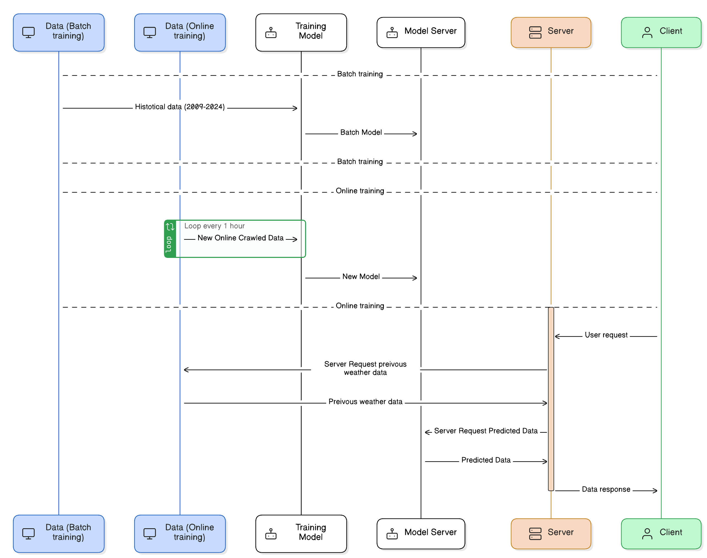

# 🌦️ Weather Forecast App

## 📌 Overview
This is a simple weather forecasting application that utilizes Machine Learning models such as ARIMA and LSTM. The application processes weather data crawled from [worldweatheronline](https://www.worldweatheronline.com/) to provide accurate temperature predictions.

## ✨ Features
- **Data Collection**: Automatically scrapes weather data from [worldweatheronline](https://www.worldweatheronline.com/).
- **ML Models**: Implements ARIMA and LSTM for time-series forecasting.
- **Visualization**: Displays temperature trends and predictions.
- **User Interface**: Simple and intuitive UI for viewing forecasts.

## Sequence Diagram

## 🚀 Usage
1️⃣ Data Collection

2️⃣ Model Training & Forecasting

3️⃣ Run Web Application 🌐

