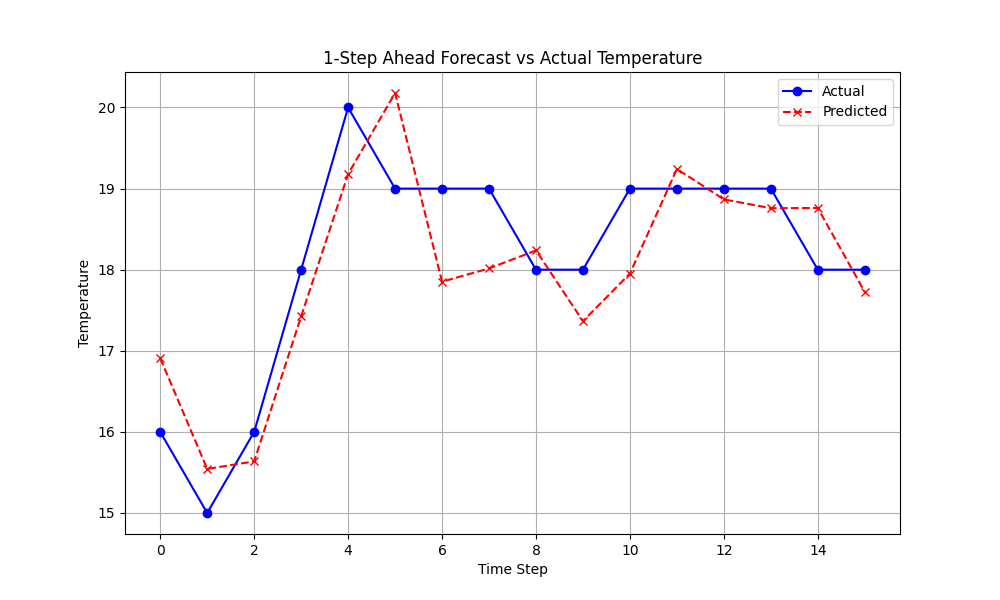
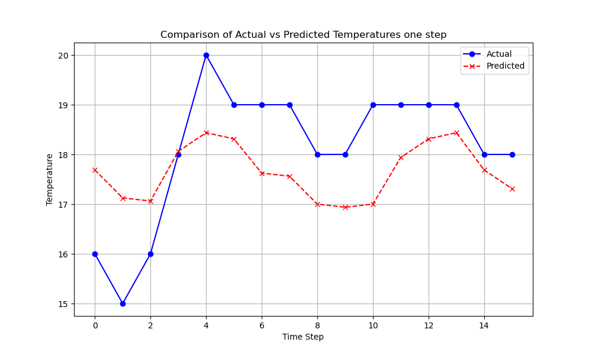
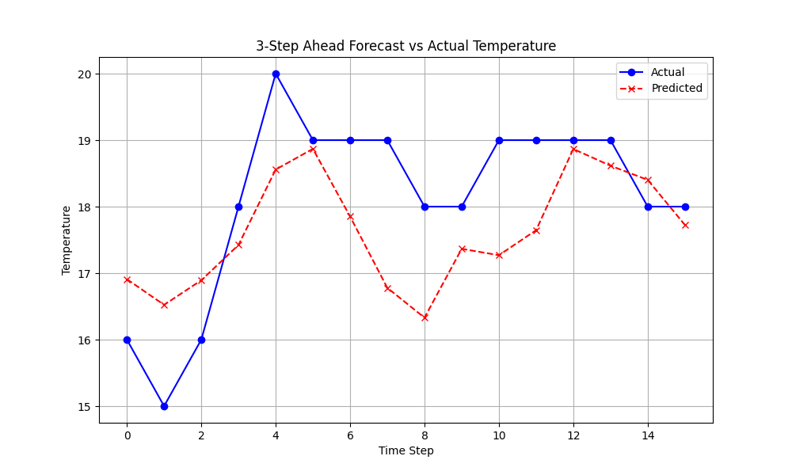

## Challenge

- The arima seem very good and predict data on rolling forecast, but if the step we want to predict is further like step >= 3 the result may not good. My goal is predict as least a day (8 steps) or a week (56 steps).
- This is result test on a day with different steps
  - With 1 step

    
  - With 2 step

    
  - With 3 step

    
- Available solution:
  - **SARIMA** Because it clearly have seasonality, maybe we use SARIMA.
  - **Feature Engineering** Add exogenous variables if available like humidity, pressure, ...
  - **Hybrid model** Combine with Exponential Smoothing.
  - **Alternative Models**...